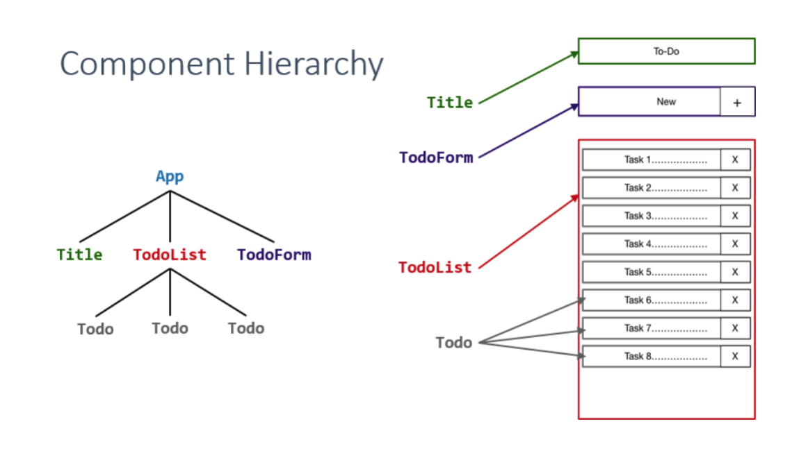

<h1 align="center">To-do list with React</h1>

#### -- Project Status: [Complete]

## ✅ Project descrption
This is a simple todo application built with React that integrates Firebase for user authentication. The app allows users to create, edit and delete tasks, and sign up and log in with their email and password. The project is structured using the component-based architecture of React, with reusable components such as TodoList, TodoForm, and Todo.

## 📹 Demo
Live: https://alyshapm.github.io/react-todo/


## 📁 File Directory

- `App.js`: This file serves as the main entry point for the application and contains the overall layout and structure of the app. It imports and renders the TodoList component, which displays the list of tasks.

- `Title.js`: This file contains the Title component, which displays the title of the application at the top of the page. It is imported and used within the App component.

- `TodoList.js`: This file contains the TodoList component, which is responsible for rendering the list of tasks. It imports and renders multiple Todo components, which represent individual tasks.

- `TodoForm.js`: This file contains the TodoForm component, which displays the form for creating new tasks. It handles user input and calls a function in the TodoList component to add the new task to the list.

- `Todo.js`: This file contains the Todo component, which represents an individual task in the list. It displays the task's title and completion status, and allows the user to delete the task.

- `Alysha.js`: This file displays the full name and student ID information and used within the App component.

- `Login.js`, `Register.js`, `Reset.js` & `Logout.js`: This files contains the logic for allowing users to log in/register/reset password/logout. It typically includes a form with fields for the user's email and password, and it uses the Firebase Authentication API to authenticate the user's credentials. If the user is authenticated successfully, the app can redirect them to dashboard (todo app).

## Component Hierarcy


## Modules
* ReactJS
* FontAwesome icons
* Firebase Authentication
* Cloud Firestore

## 👩‍💻 Run locally

To run this app on your local machine, you will need to have Node.js and npm (or yarn) installed.

1. Clone this repo.
```bash
git clone https://github.com/alyshapm/react-todo
```
2. Switch directory to the app folder.
```bash
cd react-todo
```
3. Create a Firebase project and set up authentication with email and password. Refer to Firebase documentation for instructions.

4. Create a `.env.local` file in the root directory of the project and add your Firebase config information as environment variables:
```bash
REACT_APP_FIREBASE_API_KEY=<your-api-key>
REACT_APP_FIREBASE_AUTH_DOMAIN=<your-auth-domain>
REACT_APP_FIREBASE_PROJECT_ID=<your-project-id>
```
5. Run file.
```bash
npm start
```

## Acknowledgements
This app was created based on  by Yusuff Faruq.
